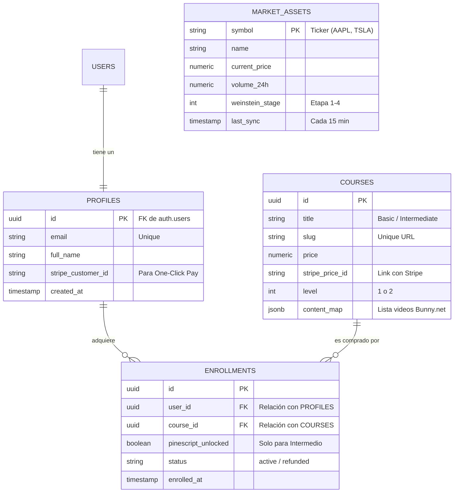

# Diagrama E-R LFI

Propietario: Armando Fiestas Anton

# 📊 Diagrama E‑R — [logforinvestor.com](http://logforinvestor.com) (MVP)

<aside>
ℹ️

**Objetivo:** visualizar entidades y relaciones mínimas para Auth + Cursos + Accesos + Filtro público.

</aside>

---

## 1) Diagrama (Mermaid)

---

## 2) Relaciones (lectura rápida)

- **USERS ↔ PROFILES (1:1)**
    
    `auth.users` es la identidad; `public.profiles` extiende el perfil con datos de negocio.
    
- **PROFILES ↔ ENROLLMENTS (1:N)**
    
    Un usuario puede comprar varios cursos; cada matrícula pertenece a un único perfil.
    
- **COURSES ↔ ENROLLMENTS (1:N)**
    
    Un curso puede ser comprado por muchos usuarios; esto habilita el control de acceso por compra.
    
- **MARKET_ASSETS (independiente / pública)**
    
    No se relaciona con usuarios: es el “motor” del filtro gratuito y se refresca periódicamente.
    

---

## 3) Lógica del MVP (por qué así)

- **Simplicidad:** 4 tablas base para reducir superficie de bugs y acelerar shipping.
- **Integridad:** `enrollments` es el “libro de registro” de pagos/accesos.
- **Escalabilidad:** puedes añadir nuevos cursos (o más niveles) agregando filas en `courses` sin rediseñar la BD.